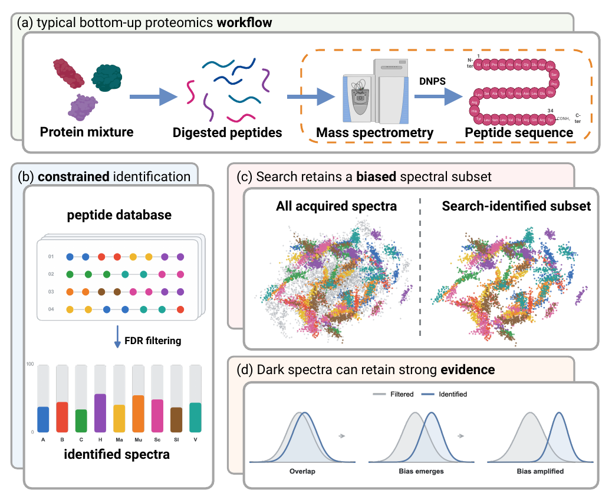
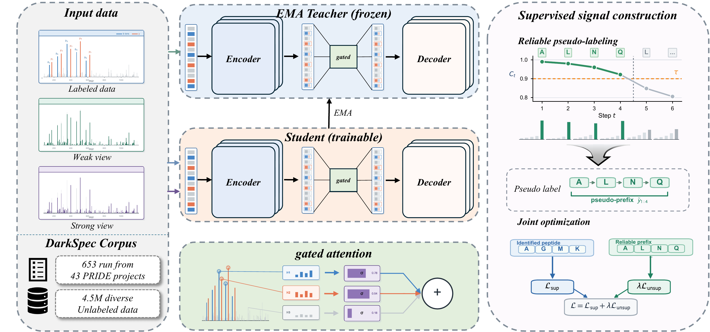

# SemiNovo

**Learning de novo peptide sequencing models from unlabeled tandem mass
spectra.**

[](LICENSE)
[](pyproject.toml)
[](https://huggingface.co/datasets/PanLiu/DarkSpec)

SemiNovo is a semi-supervised framework for de novo peptide sequencing. It
combines labeled peptide-spectrum pairs with unlabeled tandem mass spectra,
allowing spectra that are normally discarded by database-search pipelines to
contribute to model training.

The implementation follows the NovoBench data and evaluation protocol and
provides reproducible supervised training, checkpoint-initialized
semi-supervised training, and beam-search evaluation.

## Motivation

Conventional database-search pipelines retain only an identifiable, biased
subset of acquired spectra. SemiNovo instead learns from curated unlabeled
spectra so that this otherwise discarded evidence can contribute to de novo
sequencing.

<p align="center">
  <a href="assets/figure1.pdf">
    
  </a>
</p>

## Method

SemiNovo contains four main components:

1. **Spectrum encoder.** Non-causal FlashAttention models interactions among
   fragment peaks without imposing an artificial peak order.
2. **Peak representation.** Multi-scale Fourier features encode continuous
   m/z and intensity values before learned fusion.
3. **Peptide decoder.** A causal Transformer decoder uses head-wise G1
   attention gates to generate modified peptide sequences.
4. **Semi-supervised learning.** An exponential-moving-average teacher creates
   cumulative-confidence pseudo-labels for unlabeled spectra. The student is
   optimized jointly on labeled and accepted unlabeled tokens.

Autoregressive decoding supports standard Casanovo-style beam search and
optional precursor-mass pruning.

<p align="center">
  <a href="assets/figure2.pdf">
    
  </a>
</p>

The figures are linked to their vector PDF versions.

## Repository layout

```text
seminovo/
├── assets/
├── configs/
│   └── seminovo.yaml
├── scripts/
│   ├── train_supervised.sh
│   ├── train_semi_supervised.sh
│   └── evaluate.sh
├── seminovo/
│   ├── models/
│   ├── data.py
│   ├── semi_data.py
│   ├── train.py
│   ├── train_semi.py
│   └── evaluate.py
├── novobench/
└── tests/
```

## Installation

SemiNovo requires a CUDA-capable GPU. The reported environment uses Python
3.11, PyTorch 2.6, CUDA 12, and FlashAttention 2.7.

```bash
git clone https://github.com/grandOrgan/Seminovo.git
cd Seminovo

python -m venv .venv
source .venv/bin/activate
pip install --upgrade pip
pip install -e .
pip install flash-attn==2.7.4.post1 --no-build-isolation
```

Install development dependencies with:

```bash
pip install -e ".[dev]"
```

## Data

### Labeled NovoBench data

The three labeled benchmarks are distributed by the NovoBench authors on
[Hugging Face](https://huggingface.co/datasets/jingbo02/NovoBench). Download
the complete 2.77 GB release with:

```bash
pip install -U huggingface_hub
hf download jingbo02/NovoBench \
  --repo-type dataset \
  --local-dir data/NovoBench
```

The downloaded benchmark directories are:

```text
data/NovoBench/data/
├── nine_species/
├── hc_pt/
└── seven_species/
```

Each labeled dataset directory uses the NovoBench parquet layout:

```text
dataset/
├── train.parquet
├── valid.parquet
└── test.parquet
```

Required columns:

| Column | Description |
|---|---|
| `mz_array` | Fragment m/z values |
| `intensity_array` | Fragment intensities |
| `precursor_mz` | Precursor m/z |
| `precursor_charge` | Precursor charge |
| `modified_sequence` | Ground-truth modified peptide |

SemiNovo uses the NovoBench residue vocabulary and canonicalizes isoleucine
(`I`) to leucine (`L`) during tokenization.

For example, train the Nine-Species benchmark with:

```bash
DATA_DIR=data/NovoBench/data/nine_species \
OUTPUT_DIR=outputs/nine_species_supervised \
bash scripts/train_supervised.sh
```

### Unlabeled DarkSpec data

[DarkSpec](https://huggingface.co/datasets/PanLiu/DarkSpec) contains 4.5
million curated unlabeled PRIDE tandem mass spectra in a memory-mappable array
store.

Download it with:

```bash
pip install -U huggingface_hub
hf download PanLiu/DarkSpec \
  --repo-type dataset \
  --local-dir data/DarkSpec
```

The downloaded directory contains:

```text
DarkSpec/
├── manifest.json
├── precursor.npy
└── spectra.npy
```

| File | Shape | Dtype | Contents |
|---|---:|---|---|
| `spectra.npy` | `(4,500,000, 150, 2)` | `float32` | m/z and normalized intensity |
| `precursor.npy` | `(4,500,000, 2)` | `float32` | precursor m/z and charge |

## Training

### 1. Supervised training

```bash
DATA_DIR=/path/to/nine_species \
OUTPUT_DIR=outputs/nine_species_supervised \
bash scripts/train_supervised.sh
```

The best model is selected by validation sequence accuracy and written under
`$OUTPUT_DIR/checkpoints/`.

### 2. Semi-supervised training

Semi-supervised training always uses the same joint labeled/unlabeled
objective. Initialization is controlled by one configuration field:

```yaml
trainer:
  load_checkpoint: /path/to/best-val-sequence-accuracy.ckpt
```

Set `load_checkpoint` to a supervised or semi-supervised checkpoint to
initialize both the online student and EMA teacher from its EMA weights. Set it
to `null` to use random initialization; no separate training entry point is
required.

```bash
DATA_DIR=/path/to/nine_species \
UNLABELED_DIR=/path/to/DarkSpec \
OUTPUT_DIR=outputs/nine_species_semi \
bash scripts/train_semi_supervised.sh
```

The semi-supervised epoch length is:

```text
max(number of labeled batches, number of unlabeled batches)
```

The shorter stream is cycled so both sources remain active throughout each
epoch.

## Evaluation

Evaluate a trained checkpoint with beam search:

```bash
DATA_DIR=/path/to/nine_species \
CHECKPOINT=/path/to/best-val-sequence-accuracy.ckpt \
OUTPUT_DIR=outputs/nine_species_test \
BEAMS=20 \
DECODE_STRATEGY=casanovo \
bash scripts/evaluate.sh
```

`DECODE_STRATEGY` can be `casanovo` or `mass_pruned`. Evaluation writes:

```text
predictions.csv
metrics.json
```

The public evaluator reports the two NovoBench peptide-level metrics used by
this release:

- **Precision:** fraction of spectra with a fully matched peptide prediction.
- **AUC:** area under the peptide precision-coverage curve after ranking
  predictions by model confidence.

## Configuration

The complete architecture, optimizer, scheduler, data preprocessing, and
decoding configuration is stored in
[`configs/seminovo.yaml`](configs/seminovo.yaml).

Important defaults include:

| Setting | Value |
|---|---:|
| Hidden dimension | 512 |
| Encoder/decoder layers | 9 |
| Attention heads | 8 |
| Supervised training epochs | 30 |
| Semi-supervised training epochs | 6 |
| Labeled batch size | 32 |
| EMA decay | 0.999 |
| Pseudo-label threshold | 0.90 |
| Maximum pseudo-label length | 32 |

Shell scripts accept additional command-line arguments after their defaults.
Run `seminovo-train --help`, `seminovo-train-semi --help`, or
`seminovo-evaluate --help` for the full interface.

## Reproducibility

```bash
pytest -q
python -m ruff check seminovo tests
```

CUDA model execution additionally requires a GPU and a working FlashAttention
installation.

The minimal NovoBench components vendored in this repository are pinned to
commit `5453cd024b56fb9f6c70dd2efb4754ec6dce2e7d`. Third-party provenance is
documented in [`NOTICE`](NOTICE).

## Acknowledgements

We gratefully acknowledge the following open-source projects and research:

- [NovoBench](https://github.com/Westlake-OmicsAI/NovoBench) for the unified
  datasets, preprocessing conventions, and evaluation protocol used throughout
  this work.
- [CSL](https://github.com/PanLiuCSU/CSL) for research insights into confidence
  estimation and pseudo-label selection in semi-supervised learning.
- [Casanovo](https://github.com/Noble-Lab/casanovo) for the Transformer-based
  de novo sequencing and beam-search foundations.
- [FlashAttention](https://github.com/Dao-AILab/flash-attention) and
  [Depthcharge](https://github.com/wfondrie/depthcharge) for efficient
  attention kernels and mass-spectrometry model components.

## License

SemiNovo is released under the [MIT License](LICENSE).
